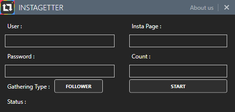

# InstaGetter
A tools to gather usernames of followers of special page

# Usage
- Page is name of user you want to gather his followers
- Count is means how many username do you want
- Account is a Instagram account such as "testInsta7203:testInsta123"

# Features
- beautiful design with MahApps.Metro in wpf
- a simple code for using [Json.NET](http://www.newtonsoft.com/json)
- working without blocking or exception
- get instagram id without api
- new method for Numberic textbox
- rename the file where the usernames are stored, if available
- can stop gathering while gathering

# Image

Thanks Avenger
